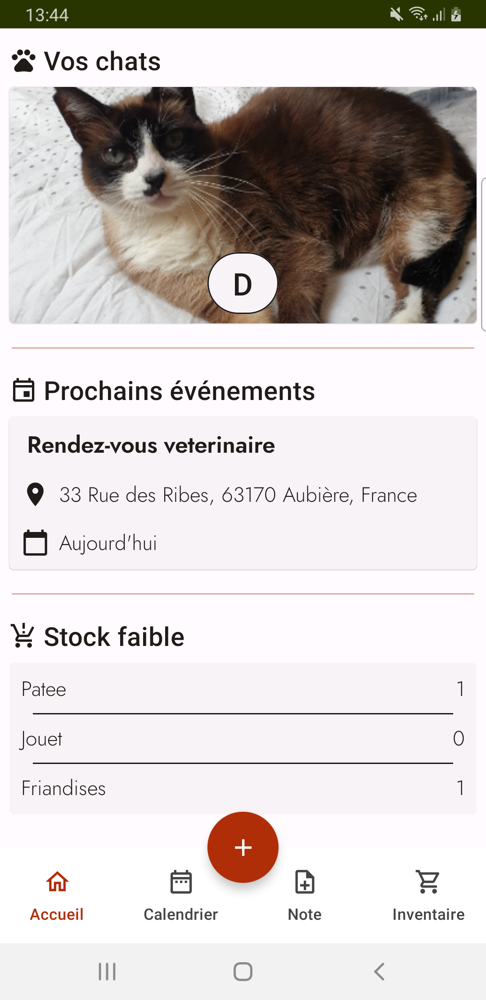
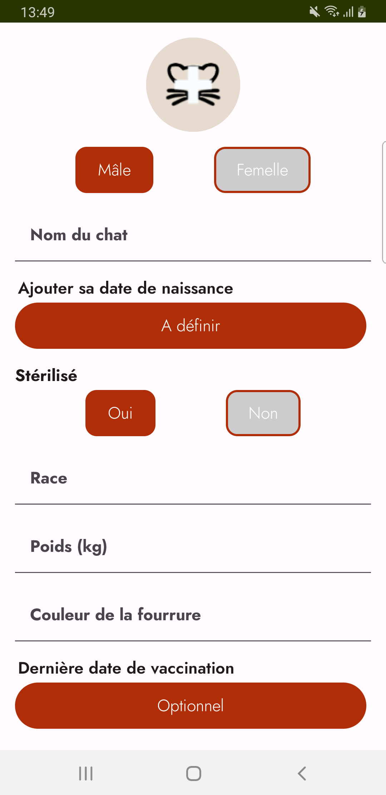
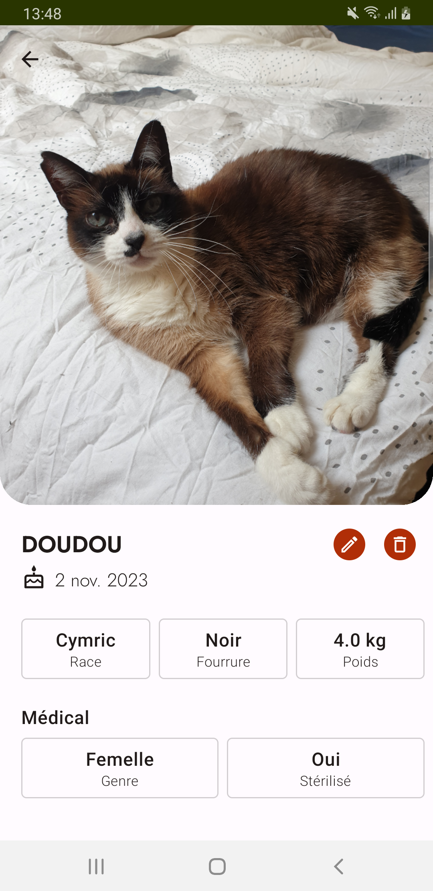
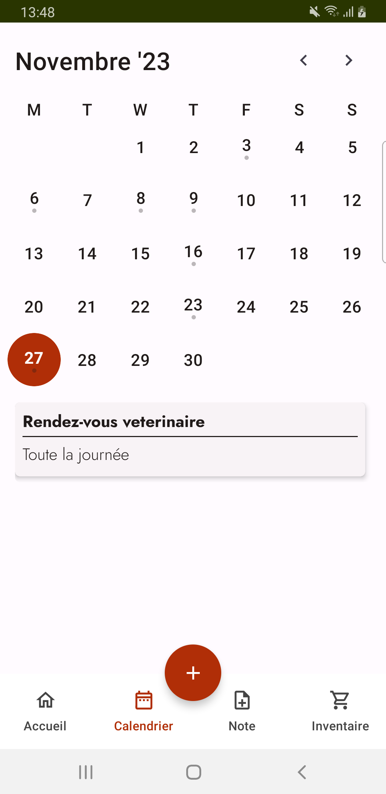
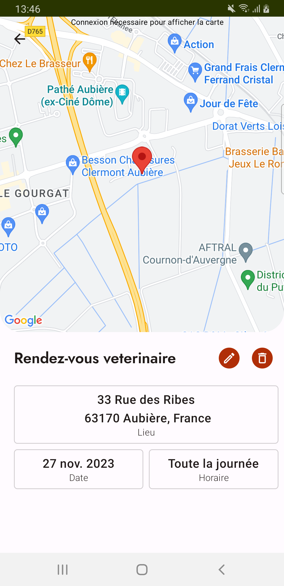
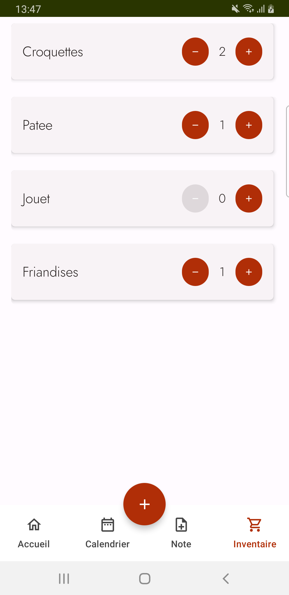

<h1 align="center">
  
</h1>

  <a href="https://github.com/morganesoula/catlife/issues/new?assignees=&labels=bug&template=01_BUG_REPORT.md&title=bug%3A+">Signaler un bug</a>
  ·
  <a href="https://github.com/morganesoula/catlife/issues/new?assignees=&labels=enhancement&template=02_FEATURE_REQUEST.md&title=feat%3A+">Proposer une feature</a>
  .
  <a href="https://github.com/morganesoula/catlife/discussions">Poser une question</a>

 

# CatLife - [V1 disponible ici](https://play.google.com/store/apps/details?id=com.msoula.catlife)

#### Table des matières
[A Propos](#a-propos) 
[Intégration](#intégration) 
[Technologies utilisées](#technologies-utilisées) 
[Fonctionnalités - Screenshots](#fonctionnalités---screenshots) 
[Support](#support) 
[Licence](#licence)

## A propos

<table>
  <tr>
    <td>
      CatLife est un projet open-source dédié aux amoureux des chats. Cette application Android offre un ensemble complet d'outils pour prendre soin de son animal au mieux. Avec CatLife, les propriétaires peuvent suivre facilement les soins vétérinaires, les vaccinations et les traitements médicaux grâce à un suivi vétérinaire intégré. Le calendrier permet de planifier et de gérer les rendez-vous importants pour assurer le bien-être de leur compagnon félin. 

  De plus, CatLife facilite la gestion de l'alimentation et de l'hygiène du chat en proposant un inventaire pratique. Les propriétaires peuvent ainsi surveiller le stock de croquettes, de litières et d'autres fournitures essentielles pour s'assurer que leur chat ne manque de rien.

Enfin, CatLife propose une fonction de prise de notes, permettant aux utilisateurs de consigner tout
changement de comportement, d'humeur ou de santé chez leur chat. Cela offre une manière simple de
garder un œil attentif sur la santé et le bien-être général de leur animal de compagnie.
</td>
  </tr>
</table>

## Intégration

Afin de profiter pleinement de ce projet open-source, vous aurez besoin d'une clé API pour le SDK Maps.

## Technologies utilisées

* Ce projet Android est entièrement développé avec [Kotlin](https://kotlinlang.org/).
* L'UI est entièrement écrite avec [Jetpack Compose](https://developer.android.com/jetpack/compose).
* L'architecture de ce projet
  associe [MVVM et Clean Architecture](https://www.youtube.com/playlist?list=PLWz5rJ2EKKc8GZWCbUm3tBXKeqIi3rcVX).
* La base de donnée choisie est [SQLDelight](https://cashapp.github.io/sqldelight/2.0.0/) afin de
  faciliter la transition lors du passage à [KMP](https://kotlinlang.org/docs/multiplatform.html).
* Les [coroutines Kotlin](https://kotlinlang.org/docs/reference/coroutines/coroutines-guide.html)
  et [Flow API](https://kotlinlang.org/docs/flow.html#flows) sont utilisés pour réaliser les appels
  au réseau et les échanges avec la base de données.
* La navigation est gérée
  par [Compose Destination](https://github.com/raamcosta/compose-destinations).
* Les images au sein de l'application sont manipulées par [Coil](https://github.com/coil-kt/coil).
* Le calendrier vient d'un projet open-source [Kalendar](https://github.com/hi-manshu/Kalendar).
  Différentes PR ont été proposées.
* [Hilt](https://dagger.dev/hilt/) a été choisie pour l'injection de dépendance.
* Les tests unitaires se basent sur [JUnit 4](https://junit.org/junit4/) et les tests fonctionnels
  utilisent [Maestro](https://maestro.mobile.dev/).

## Fonctionnalités - Screenshots

 

 

 

## Support

N'hésitez pas à me contacter à l'aide de ces deux liens:

- [GitHub discussions](https://github.com/morganesoula/CatLifeBis/discussions)
- Par e-mail soula.morgane35@gmail.com

## Licence

Ce projet est couvert par la licence MIT.  
Voir [LICENSE](LICENSE) pour plus d'informations.